<p align="center"></p>

[](https://github.com/s-weissbach/metroplot/actions/workflows/test.yml)
[](https://www.python.org/)
[](LICENSE)
[](https://matplotlib.org/)

[](https://pypi.org/project/metroplot/)

**metroplot** turns bioinformatics pipelines into subway-style diagrams. You place stations on a grid, connect them with coloured lines, and metroplot handles the rest: parallel-track offsets when lines share a segment, right-angle routing, station circles, and labels.

<p align="center">
  
</p>

---

## Install

```sh
pip install metroplot
```

The only hard dependency is `matplotlib`.

---

## Quick start

```python
from metroplot import Diagram
import matplotlib.pyplot as plt

d = Diagram()
d.station("raw",  0, 0, "FASTQ",       "RAW READS")
d.station("qc",   2, 0, "FastQC",      "QUALITY CTRL")
d.station("trim", 4, 0, "Trim Galore", "TRIMMING")
d.station("star", 6, 0, "STAR",        "ALIGNMENT")
d.station("de",   8, 0, "DESeq2",      "DIFF EXPR")

d.line("RNA-seq", "#e8614a", [["raw", "qc", "trim", "star", "de"]])

ax = d.render()
plt.savefig("pipeline.png", bbox_inches="tight")
```

---

## How it works

There are three building blocks:

**Stations** are the tools or steps in your pipeline. Each station sits at an `(x, y)` coordinate on an integer grid. You choose the layout — metroplot does not auto-arrange stations.

```python
d.station("star", 6, 0, "STAR", "ALIGNMENT")
#          key    x  y   label   sub-label
```

**Lines** are the coloured tracks connecting stations. A line owns one or more *routes* (lists of station keys). When a route passes through two stations that aren't on the same row or column, metroplot draws a right-angle bend automatically.

```python
d.line("RNA-seq", "#e8614a", [["raw", "qc", "trim", "star", "de"]])
#       name       colour      routes (list of lists)
```

**Shared segments** are handled automatically. When two lines pass through the same pair of stations, they are drawn as side-by-side parallel tracks with a small perpendicular offset — no extra configuration needed.

---

## Edge labels

Label a segment with the data format flowing through it. The track is interrupted at the midpoint; the text matches the line colour and sits at the same visual weight as the track width.

```python
d.line("Bulk RNA-seq", "#1f2a44", [["fastq", "star", "fcounts", "deseq2"]], edge_labels={
    ("fastq",   "star"):    "fastq",
    ("star",    "fcounts"): "BAM",
    ("fcounts", "deseq2"):  "counts",
})
```

> **Rule:** if a segment is shared by multiple lines, annotate it on *all* of them or on *none*. Mixing leaves some parallel tracks labelled and others silent, which looks inconsistent.

---

## Themes

### Built-in themes

Three themes ship with metroplot. All use a transparent background so diagrams embed cleanly into any document or slide.

**`"light"`** *(default)* — clean white, coloured station rings, no glow. Best for papers and reports.

<p align="center">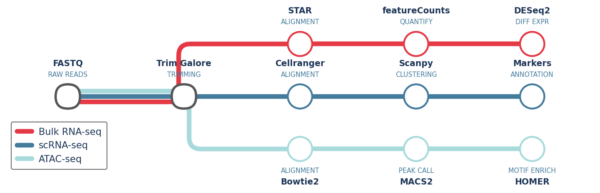</p>

```python
d = Diagram(theme="light")
```

---

**`"dark"`** — dark background, glowing tracks, coloured rings. Best for dark slides or dark-mode docs.

<p align="center">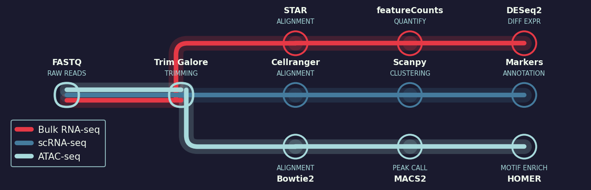</p>

```python
d = Diagram(theme="dark")
```

---

**`"minimal"`** — thinner strokes, no inner dots, muted colours. Best for publications.

<p align="center">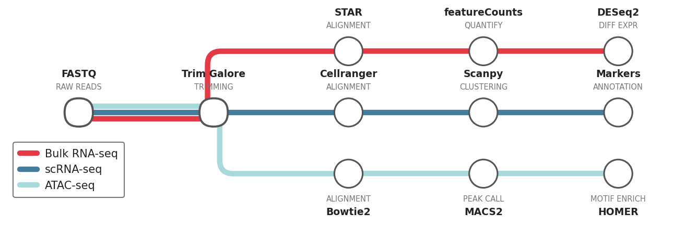</p>

```python
d = Diagram(theme="minimal")
```

---

### City themes

metroplot ships with six city themes, each bundling the official line colours of a real metro system with a matching visual style. Load any of them by name — then tune `line_width` and `corner_radius` on `Diagram` to nail the visual weight of the reference map.

---

**`"london"`** — London Underground. White background, near-black labels, TfL official colours. Thick rounded tracks (Central red, Piccadilly blue, District green).

<p align="center">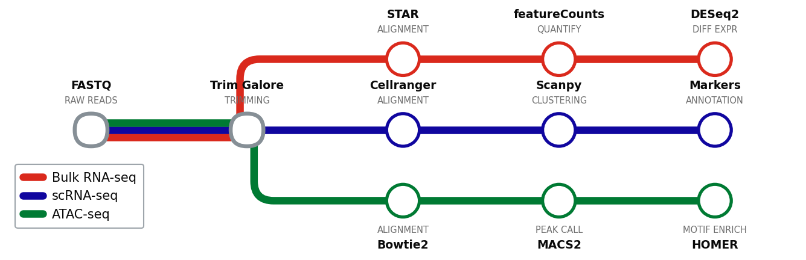</p>

```python
from metroplot.themes import PALETTES

d = Diagram(theme="london", line_width=6, corner_radius=0.25, legend_loc="lower left")
c1, c2, c3 = PALETTES["london"][:3]   # Central red · Piccadilly blue · District green
d.line("Bulk RNA-seq", c1, [...])
d.line("scRNA-seq",    c2, [...])
d.line("ATAC-seq",     c3, [...])
```

---

**`"tokyo"`** — Tokyo Metro + Toei. White background, dark navy labels, vivid high-contrast colours (Ginza orange, Marunouchi red, Tozai cyan).

<p align="center">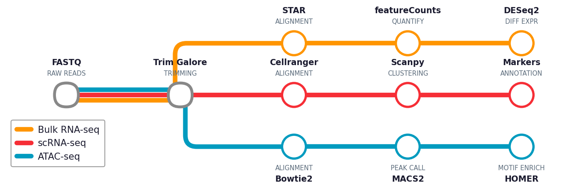</p>

```python
from metroplot.themes import PALETTES

d = Diagram(theme="tokyo", line_width=5, corner_radius=0.20, legend_loc="lower left")
c1, c2, c3 = PALETTES["tokyo"][:3]    # Ginza orange · Marunouchi red · Tozai cyan
d.line("Bulk RNA-seq", c1, [...])
d.line("scRNA-seq",    c2, [...])
d.line("ATAC-seq",     c3, [...])
```

---

**`"nyc"`** — NYC Subway (MTA). White background, pure black labels, bold primaries with maximum contrast. Minimal corner rounding matches the map's sharp geometry.

<p align="center">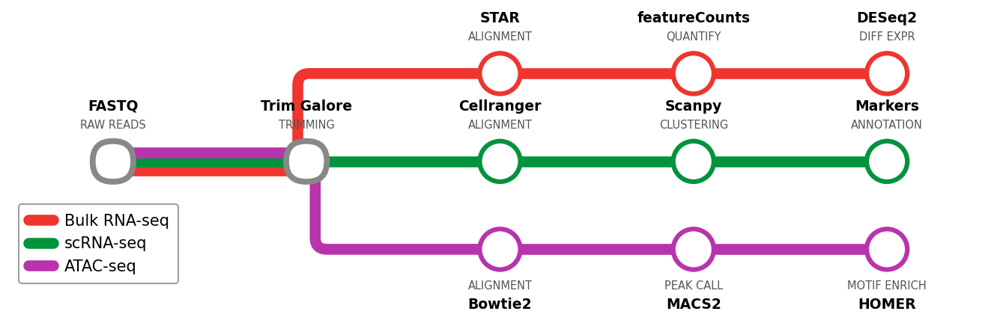</p>

```python
from metroplot.themes import PALETTES

d = Diagram(theme="nyc", line_width=7, corner_radius=0.12, legend_loc="lower left")
c1, c2, c3 = PALETTES["nyc"][:3]      # 1/2/3 red · 4/5/6 green · 7 purple
d.line("Bulk RNA-seq", c1, [...])
d.line("scRNA-seq",    c2, [...])
d.line("ATAC-seq",     c3, [...])
```

---

**`"paris"`** — Paris Métro (RATP). Warm cream background, warm dark labels. Rich golds, deep blues, and pastels from the M1–M14 palette.

<p align="center">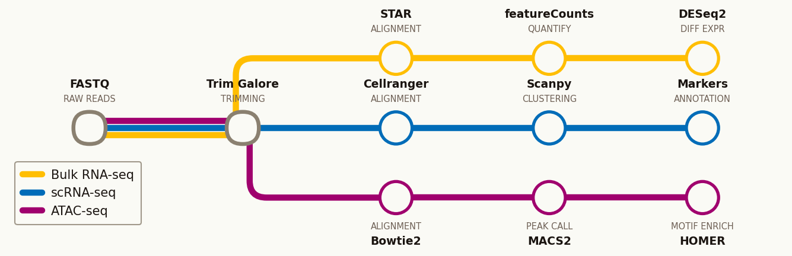</p>

```python
from metroplot.themes import PALETTES

d = Diagram(theme="paris", line_width=5, corner_radius=0.22, legend_loc="lower left")
c1, c2, c3 = PALETTES["paris"][:3]    # M1 gold · M2 blue · M4 purple
d.line("Bulk RNA-seq", c1, [...])
d.line("scRNA-seq",    c2, [...])
d.line("ATAC-seq",     c3, [...])
```

---

**`"berlin"`** — Berlin U-Bahn / S-Bahn (BVG). Light grey background, neutral dark labels. Saturated primaries and earth tones across U- and S-Bahn lines.

<p align="center">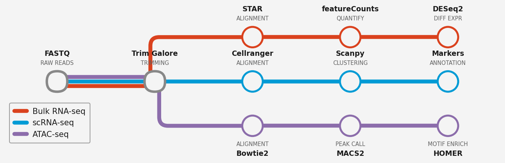</p>

```python
from metroplot.themes import PALETTES

d = Diagram(theme="berlin", line_width=5, corner_radius=0.18, legend_loc="lower left")
c1, c2, c3 = PALETTES["berlin"][:3]   # U2 red · U7 blue · U6 purple
d.line("Bulk RNA-seq", c1, [...])
d.line("scRNA-seq",    c2, [...])
d.line("ATAC-seq",     c3, [...])
```

---

**`"hongkong"`** — Hong Kong MTR. Crisp white background, corporate navy labels. Clean and high-contrast.

<p align="center">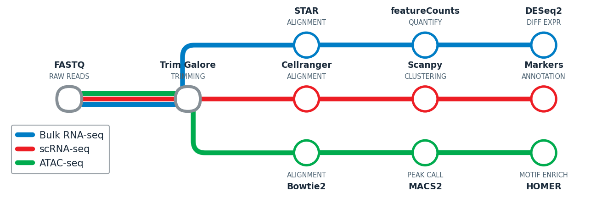</p>

```python
from metroplot.themes import PALETTES

d = Diagram(theme="hongkong", line_width=5, corner_radius=0.20, legend_loc="lower left")
c1, c2, c3 = PALETTES["hongkong"][:3] # Island blue · Tsuen Wan red · Kwun Tong green
d.line("Bulk RNA-seq", c1, [...])
d.line("scRNA-seq",    c2, [...])
d.line("ATAC-seq",     c3, [...])
```

---

### Custom themes

Define a fully custom theme by constructing a `Theme` directly and registering it:

```python
from metroplot.themes import Theme, THEMES

THEMES["mylab"] = Theme(
    name="mylab",
    label_color="#2a2a2a",
    sub_color="#666666",
    palette=["#e63946", "#457b9d", "#a8dadc", "#1d3557"],
)
d = Diagram(theme="mylab")
```

---

## Animated SVG

Pass `animate=True` to `save_svg` to inject metro carts that travel along every line:

```python
d.save_svg("pipeline.svg", animate=True)
```

The carts follow the exact rendered track positions, including lateral offsets on shared segments.

---

## Layout patterns

metroplot diagrams are hand-laid on a grid, so the visual structure is entirely up to you. The five patterns below cover most pipeline shapes.

---

### Linear

The simplest layout — one line of stations going left to right.

<p align="center">
  
</p>

```python
d = Diagram()
d.station("raw",   0, 0, "FASTQ",         "RAW READS")
d.station("qc",    2, 0, "FastQC",        "QUALITY CTRL")
d.station("trim",  4, 0, "Trim Galore",   "TRIMMING")
d.station("align", 6, 0, "STAR",          "ALIGNMENT")
d.station("quant", 8, 0, "featureCounts", "QUANTIFICATION")
d.station("de",   10, 0, "DESeq2",        "DIFF EXPR")
d.line("RNA-seq", "#e8614a", [["raw", "qc", "trim", "align", "quant", "de"]])
```

---

### Parallel lanes

A shared preprocessing trunk forks into independent assay-specific lanes. Each lane sits at a different y-coordinate; stations on the shared trunk appear in every line's route.

<p align="center">
  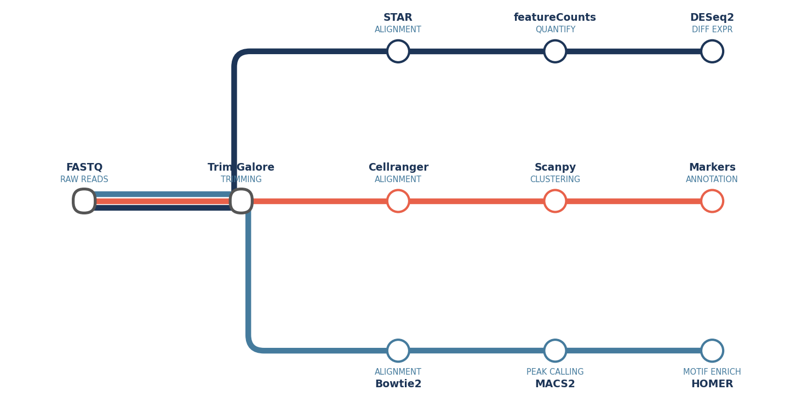
</p>

```python
# Shared trunk at y=0
d.station("fastq", 0, 0, ...)
d.station("trim",  2, 0, ...)

# One y-level per assay
d.station("star", 4,  2, ...)   # Bulk RNA-seq lane
d.station("cr",   4,  0, ...)   # scRNA-seq lane (stays at y=0)
d.station("bw",   4, -2, ...)   # ATAC-seq lane

# Shared stations are listed in every route
d.line("Bulk RNA-seq", NAVY,  [["fastq", "trim", "star", ...]])
d.line("scRNA-seq",    CORAL, [["fastq", "trim", "cr",   ...]])
d.line("ATAC-seq",     BLUE,  [["fastq", "trim", "bw",   ...]])
```

---

### Wide fan-out

One line with multiple routes, all originating from a shared hub. Use `bend="vh"` so each branch first drops to its target row and then extends horizontally — this creates the characteristic vertical trunk with outward branches.

<p align="center">
  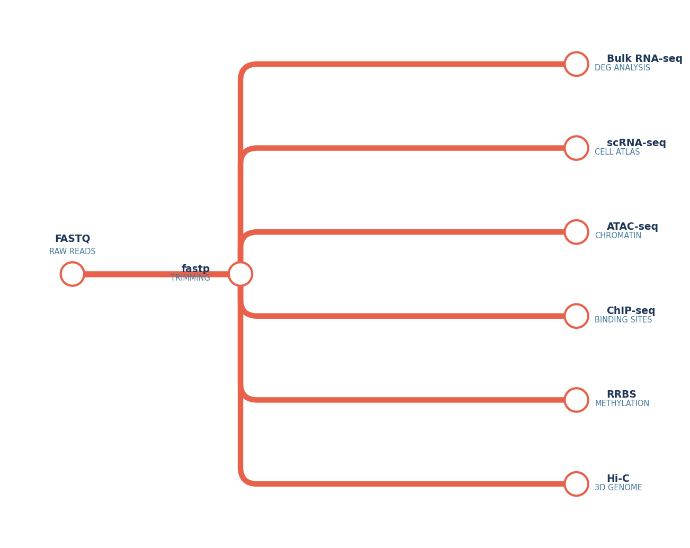
</p>

```python
d = Diagram(auto_bend=False)
d.station("input", 0, 0, "FASTQ", "RAW READS")
d.station("hub",   2, 0, "fastp", "TRIMMING")

branches = [
    ("rna",   "Bulk RNA-seq", "DEG ANALYSIS",  2.5),
    ("scrna", "scRNA-seq",    "CELL ATLAS",    1.5),
    ("atac",  "ATAC-seq",     "CHROMATIN",     0.5),
    ("chip",  "ChIP-seq",     "BINDING SITES",-0.5),
    ("meth",  "RRBS",         "METHYLATION",  -1.5),
    ("hic",   "Hi-C",         "3D GENOME",    -2.5),
]
routes = []
for name, label, sub, y in branches:
    d.station(name, 6, y, label, sub, "right")
    routes.append(["input", "hub", name])

d.line("Multi-omics", "#e8614a", routes, bend="vh")
```

---

### Loop-back

Lines travel right along a shared trunk, bend at a common step, and return left on separate rows — one row per downstream branch. This fits pipelines where multiple analyses diverge from a single expensive step such as alignment.

<p align="center">
  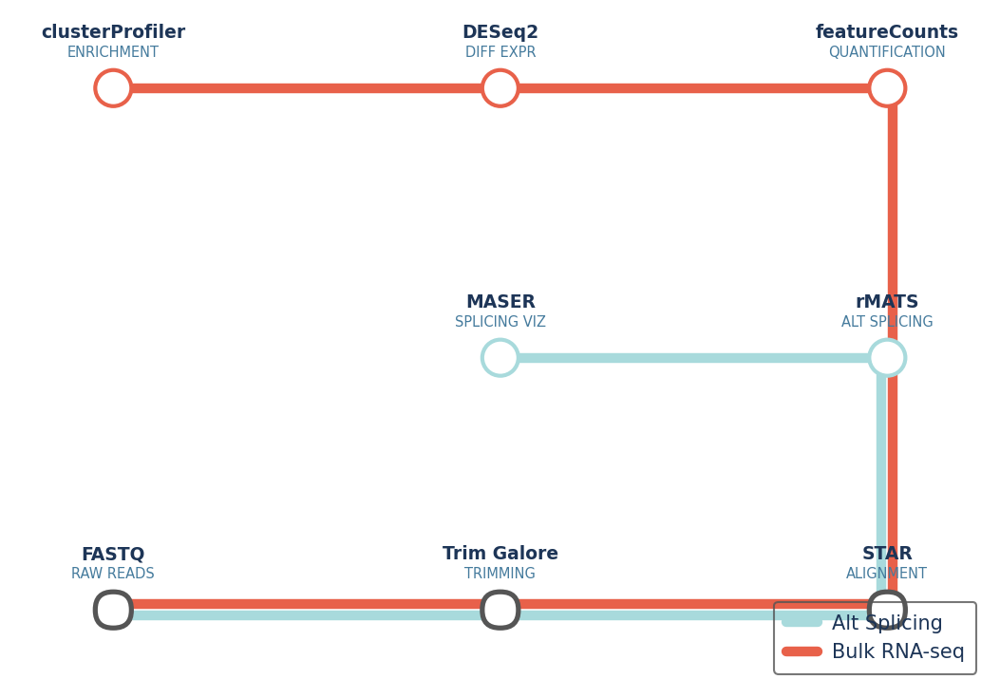
</p>

```python
# Shared trunk at y=0 — going right
d.station("raw",   0, 0, "FASTQ",       "RAW READS")
d.station("trim",  3, 0, "Trim Galore", "TRIMMING")
d.station("star",  6, 0, "STAR",        "ALIGNMENT")  # bend point

# Each branch returns left on its own row
d.station("rmats", 6, 2, "rMATS", "ALT SPLICING")     # y=2 branch
d.station("maser", 3, 2, "MASER", "SPLICING VIZ")

d.station("quant", 6, 4, "featureCounts", "QUANTIFY") # y=4 branch
d.station("de",    3, 4, "DESeq2",        "DIFF EXPR")
d.station("enrich",0, 4, "clusterProfiler","ENRICHMENT")

d.line("Alt Splicing", TEAL,  [["raw", "trim", "star", "rmats", "maser"]])
d.line("Bulk RNA-seq", CORAL, [["raw", "trim", "star", "quant", "de", "enrich"]])
```

---

### Serpentine

A long linear pipeline that snakes back and forth across multiple rows. Place the turnaround stations at the same x-coordinate on adjacent rows so metroplot draws a clean vertical connector — no L-bend configuration needed.

<p align="center">
  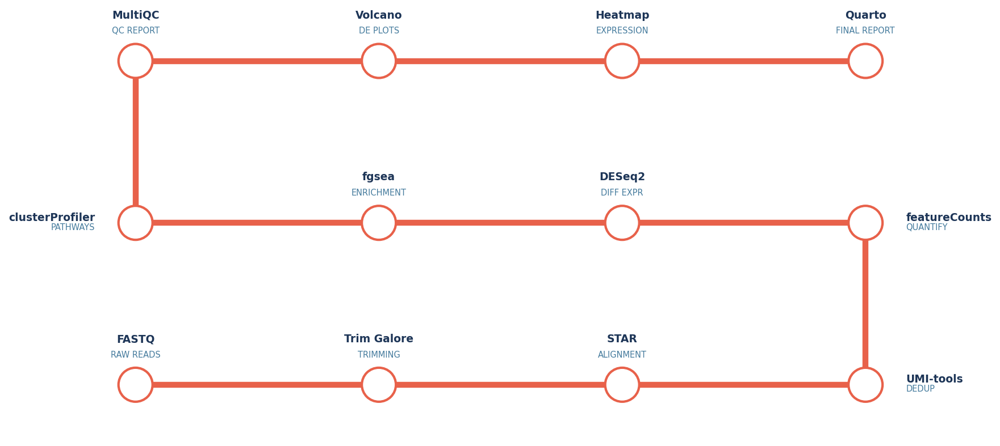
</p>

```python
d = Diagram()
# Row 0 — left → right (y=0)
d.station("s00", 0, 0, "FASTQ",         "RAW READS")
d.station("s01", 3, 0, "Trim Galore",   "TRIMMING")
d.station("s02", 6, 0, "STAR",          "ALIGNMENT")
d.station("s03", 9, 0, "UMI-tools",     "DEDUP")       # right turn-around

# Row 1 — right → left (y=2); s03 and s10 share x=9 → vertical connector
d.station("s10", 9, 2, "featureCounts", "QUANTIFY")
d.station("s11", 6, 2, "DESeq2",        "DIFF EXPR")
d.station("s12", 3, 2, "fgsea",         "ENRICHMENT")
d.station("s13", 0, 2, "clusterProfiler","PATHWAYS")   # left turn-around

# Row 2 — left → right (y=4); s13 and s20 share x=0 → vertical connector
d.station("s20", 0, 4, "MultiQC",       "QC REPORT")
d.station("s21", 3, 4, "Volcano",       "DE PLOTS")
d.station("s22", 6, 4, "Heatmap",       "EXPRESSION")
d.station("s23", 9, 4, "Quarto",        "FINAL REPORT")

d.line("RNA-seq", "#e8614a", [[
    "s00","s01","s02","s03",   # row 0 →
    "s10","s11","s12","s13",   # row 1 ←
    "s20","s21","s22","s23",   # row 2 →
]])
```

---

## Tuning

Pass any of these to `Diagram(...)` to control the visual output:

| Parameter | Default | Description |
|---|---|---|
| `line_width` | `4.0` | Track stroke width in points |
| `track_spacing` | `0.09` | Gap between parallel tracks on a shared segment, in data units |
| `station_radius` | `0.21` | Station circle radius in data units |
| `station_linewidth` | `2.5` | Station circle border width in points |
| `corner_radius` | `0.20` | Rounding radius for L-bend corners, in data units |
| `label_font` | `9` | Font size for station main labels, in points |
| `sub_font` | `7` | Font size for station sub-labels, in points |
| `legend_loc` | `None` | Legend position, e.g. `"lower right"` — omit to hide |
| `auto_bend` | `True` | Automatically choose hv/vh bend to avoid overlapping stations |
| `theme` | `"light"` | `"light"`, `"dark"`, `"minimal"`, or a custom `Theme` object |

---

## Testing

```sh
pip install -e ".[dev]"
pytest
```

CI runs the suite on Python 3.10, 3.11, and 3.12 (see [`.github/workflows/test.yml`](.github/workflows/test.yml)).

---

## License

[MIT](LICENSE).
