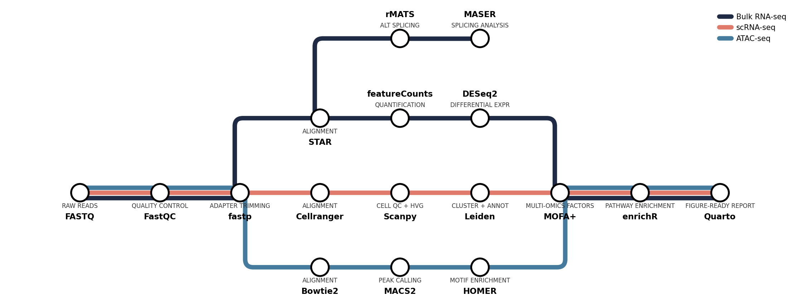

# metroplot

[](https://github.com/s-weissbach/metroplot/actions/workflows/test.yml)
[](https://www.python.org/)
[](LICENSE)
[](https://matplotlib.org/)

Subway-style pipeline diagrams for matplotlib. Define stations on a grid and lines that connect them; the renderer handles right-angle routing, parallel-track offsets where lines share segments, and station labels.



## Why

Pipeline figures in publications often want to look like a transit map: clear stops, parallel branches, splits and merges. Drawing one by hand in Illustrator is tedious and brittle. `metroplot` turns the figure into a small declarative spec you can keep next to your manuscript.

## Install

No package on PyPI yet — drop `metroplot.py` next to your script. Only dependency is `matplotlib`.

## Usage

```python
import matplotlib.pyplot as plt
from metroplot import Diagram

NAVY, SALMON = "#1f2a44", "#e07a6b"

d = Diagram()
(d.station("sra",    0.0,  0.0, "SRA tool", "DATA DOWNLOAD", "below")
  .station("fastqc", 2.0,  0.0, "fastqc",   "QUALITY CONTROL")
  .station("star",   6.0,  0.0, "STAR",     "ALIGNMENT")
  .station("rmats",  9.0,  0.0, "rMATS",    "ALT SPLICING")
  .station("bam",    8.0, -1.5, "bamCoverage", "COVERAGE", "below")
  .station("fc",     6.0, -2.5, "featureCounts", "QUANTIFICATION", "below"))

# A line is a list of routes. Multiple routes that share a station encode a split.
d.line("splicing", SALMON, [
    ["sra", "fastqc", "star", "rmats"],
    ["rmats", "bam"],          # branch off rmats
])
d.line("quant", NAVY, [
    ["sra", "fastqc", "star", "fc"],
])

d.render()
plt.savefig("pipeline.png", dpi=150, bbox_inches="tight")
```

Run [example.py](example.py) to regenerate the figure at the top.

## Concepts

- **Station** — a node at `(x, y)` on a grid. You control layout fully; there's no auto-layout.
- **Line** — a colored route, owning one or more `routes` (lists of station names). Splits are implicit: two routes that share a station diverge there.
- **Shared segments** — when multiple lines traverse the same `(a, b)` segment, they're auto-offset perpendicular to the segment so they render as parallel tracks.
- **Bends** — non-collinear hops use an L-shape. Per-line `bend="hv"` (horizontal then vertical, default) or `"vh"`.

## Tuning

`Diagram(track_spacing=..., station_radius=..., line_width=..., label_font=..., sub_font=...)` exposes the visual knobs.

## Testing

```sh
pip install matplotlib pytest
pytest
```

CI runs the suite on Python 3.10, 3.11, and 3.12 (see [`.github/workflows/test.yml`](.github/workflows/test.yml)).

## License

[MIT](LICENSE).
