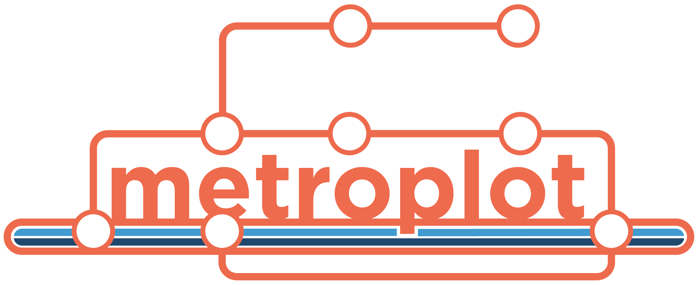
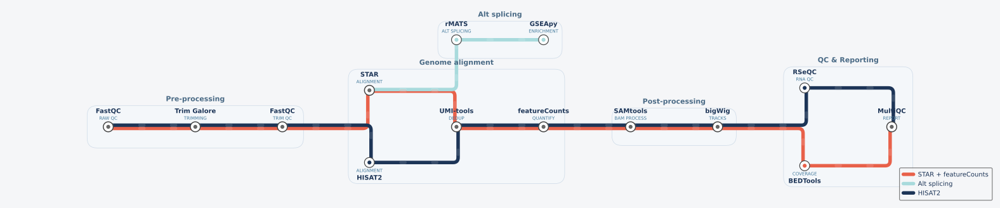

<p align="center"></p>

[](https://github.com/s-weissbach/metroplot/actions/workflows/test.yml)
[](https://www.python.org/)
[](LICENSE)
[](https://matplotlib.org/)

Subway-style pipeline diagrams for matplotlib. Define stations on a grid and lines that connect them; the renderer handles right-angle routing, parallel-track offsets where lines share segments, and station labels.

<p align="center">
  
</p>


## Install

```sh
pip install metroplot
```

Or from source:

```sh
git clone https://github.com/s-weissbach/metroplot.git
cd metroplot
pip install -e .
```

Only hard dependency is `matplotlib`.

## Usage

```python
import dataclasses, matplotlib.pyplot as plt
from metroplot import Diagram
from metroplot.themes import LIGHT, PALETTES, LOGO_ORANGE

_, BLUE, TEAL, NAVY = PALETTES["default"]

# Warm off-white background; transparent ("none") works too
theme = dataclasses.replace(LIGHT, background="#f5f6f8")

d = Diagram(theme=theme, legend_loc="lower right",
            line_width=5.5, station_radius=0.20, label_font=10, sub_font=7)

# Pre-processing
d.station("fastqc_raw",  0,    0,    "FastQC",        "RAW QC",       "above")
d.station("trim",        3.5,  0,    "Trim Galore",   "TRIMMING",     "above")
d.station("fastqc_trim", 7,    0,    "FastQC",        "TRIM QC",      "above")

# Genome alignment (STAR / HISAT2 fork)
d.station("star",        10.5, 1.5,  "STAR",          "ALIGNMENT",    "above")
d.station("hisat2",      10.5, -1.5, "HISAT2",        "ALIGNMENT",    "below")
d.station("umitools",    14,   0,    "UMI-tools",     "DEDUP",        "above")
d.station("fcounts",     17.5, 0,    "featureCounts", "QUANTIFY",     "above")

# Alt splicing branch from STAR (own line, own colour)
d.station("rmats",       14,   3.5,  "rMATS",         "ALT SPLICING", "above")
d.station("gseapy",      17.5, 3.5,  "GSEApy",        "ENRICHMENT",   "above")

# Post-processing
d.station("samtools",    21,   0,    "SAMtools",      "BAM PROCESS",  "above")
d.station("bigtwig",     24.5, 0,    "bigWig",        "TRACKS",       "above")

# QC & Reporting — BEDTools on main track, RSeQC on HISAT2 track
d.station("rseqc",       28,   1.5,  "RSeQC",         "RNA QC",       "above")
d.station("bedtools",    28,   -1.5, "BEDTools",      "COVERAGE",     "below")
d.station("multiqc",     31.5, 0,    "MultiQC",       "REPORT",       "above")

# Lines
d.line("STAR + featureCounts", LOGO_ORANGE, [
    ["fastqc_raw", "trim", "fastqc_trim", "star",
     "umitools", "fcounts", "samtools", "bigtwig", "bedtools", "multiqc"],
])
d.line("Alt splicing", TEAL, [
    ["star", "rmats", "gseapy"],
])
d.line("HISAT2", NAVY, [
    ["fastqc_raw", "trim", "fastqc_trim", "hisat2",
     "umitools", "fcounts", "samtools", "bigtwig", "rseqc", "multiqc"],
])

# Section grouping boxes
d.section("Pre-processing",   stations=["fastqc_raw", "trim", "fastqc_trim"], padding=0.85)
d.section("Genome alignment", stations=["star", "hisat2", "umitools", "fcounts"], padding=0.85)
d.section("Alt splicing",     stations=["rmats", "gseapy"],                     padding=0.75)
d.section("Post-processing",  stations=["samtools", "bigtwig"],                 padding=0.75)
d.section("QC & Reporting",   stations=["rseqc", "bedtools", "multiqc"],        padding=0.85)

fig, ax = plt.subplots(figsize=(22, 7))
d.save_svg("pipeline.svg", ax=ax, animate=True)   # animated SVG
plt.close(fig)
```

## CLI

After `pip install metroplot` the `metroplot` command is available:

```sh
# From a Snakemake workflow directory
metroplot snakemake path/to/workflow -o pipeline.png

# From a Nextflow DSL2 directory
metroplot nextflow path/to/workflow -o pipeline.png

# Common options
metroplot snakemake path/to/workflow \
  --line-name "My pipeline" \
  --color "#1f2a44" \
  --label-overrides '{"star_align":"STAR"}' \
  --sub-overrides '{"star_align":"ALIGNMENT"}' \
  --column-spacing 2.5 \
  --branch-spacing 2.5 \
  --no-legend \
  --dpi 300 \
  --figsize 18 6
```

## Pipeline workflows

metroplot ships with parsers that turn a workflow definition into a Diagram automatically. Two formats are supported:

- **Snakemake** — `from metroplot.snakemake_io import from_snakemake` parses every `Snakefile` / `*.smk` under a directory, matches each rule's `output:` paths to downstream `input:` paths to derive the DAG.
- **Nextflow (DSL2)** — `from metroplot.nextflow_io import from_nextflow` parses every `*.nf` file, finds `process NAME { … }` blocks, and extracts edges by reading `workflow { … }` blocks for invocations like `STAR(TRIM.out)`.

Both share the same downstream layout/Diagram-builder (`metroplot._pipeline_layout`): the longest source-to-sink path becomes the `y = 0` spine, off-spine rules drop below at `branch_spacing`, and every parameter (label overrides, sub-labels, lanes, colors, column spacing) is exposed as a kwarg.

```python
from metroplot.snakemake_io import from_snakemake   # or: from metroplot.nextflow_io import from_nextflow

d = from_snakemake(
    "path/to/workflow",
    line_name="My pipeline",
    label_overrides={"run_method": "scanpy/Seurat"},     # snake_case rule name → display label
    sub_overrides={"run_method": "ANNOTATION"},          # small uppercase line under each label
    lanes={                                              # optional: split into multiple parallel lines
        "QC":   {"color": "#aaaaaa", "rules": ["FASTQC", "MULTIQC"]},
        "Main": {"color": "#1f2a44", "rules": ["FASTP", "STAR", "FEATURECOUNTS", "DESEQ2"]},
    },
)
d.render()
```

End-to-end demos:

- Snakemake on a real cell-type annotation benchmarking workflow → [examples/example_snakemake.py](examples/example_snakemake.py) → [graphics/snakemake_example.png](graphics/snakemake_example.png)
- Nextflow on an nf-core-style RNA-seq pipeline → [examples/example_nextflow.py](examples/example_nextflow.py) → [graphics/nextflow_example.png](graphics/nextflow_example.png)

Both parsers are best-effort regex-based and do not understand dynamic rules / checkpoint outputs (Snakemake) or subworkflow imports / channel operators like `map`, `branch`, `combine` (Nextflow). For anything they miss, override at the kwarg layer or pass extra rules/edges into `metroplot._pipeline_layout.build_diagram_from_dag` directly.

## Concepts

- **Station** — a node at `(x, y)` on a grid. You control layout fully; there's no auto-layout.
- **Line** — a colored route, owning one or more `routes` (lists of station names). Splits are implicit: two routes that share a station diverge there.
- **Shared segments** — when multiple lines traverse the same `(a, b)` segment, they're auto-offset perpendicular to the segment so they render as parallel tracks.
- **Bends** — non-collinear hops use an L-shape. Per-line `bend="hv"` (horizontal then vertical, default) or `"vh"`.

## Themes

Three built-in themes — all use a **transparent background** so diagrams embed cleanly into any document or slide:

| Name | Use case |
|---|---|
| `"light"` (default) | Light documents, papers, light-mode web |
| `"dark"` | Dark slides, dark-mode docs — coloured station rings + track glow |
| `"minimal"` | Publications — thinner lines, no inner dots |

```python
d = Diagram(theme="dark")
```

A default colour palette is available for multi-line diagrams:

```python
from metroplot.themes import PALETTES

RED, BLUE, TEAL, NAVY = PALETTES["default"]  # #e63946, #457b9d, #a8dadc, #1d3557

d.line("RNA-seq",  RED,  routes1)
d.line("ChIP-seq", NAVY, routes2)
```

Add your own theme:

```python
from metroplot.themes import Theme, THEMES

THEMES["myteam"] = Theme(
    name="myteam",
    label_color="#2a2a2a",
    sub_color="#666666",
    palette=["#e63946", "#457b9d", "#a8dadc", "#1d3557"],
)
```

### Animated SVG

Pass `animate=True` to `save_svg` to inject flowing-dash animation (data moving through the pipeline):

```python
d.save_svg("pipeline.svg", animate=True)
```

Or from the CLI:

```sh
metroplot nextflow path/to/workflow --theme dark --animate -o pipeline.svg
```

## Tuning

`Diagram(track_spacing=..., station_radius=..., line_width=..., label_font=..., sub_font=...)` exposes the visual knobs.

## Testing

```sh
pip install -e ".[dev]"
pytest
```

CI runs the suite on Python 3.10, 3.11, and 3.12 (see [`.github/workflows/test.yml`](.github/workflows/test.yml)).

## License

[MIT](LICENSE).
